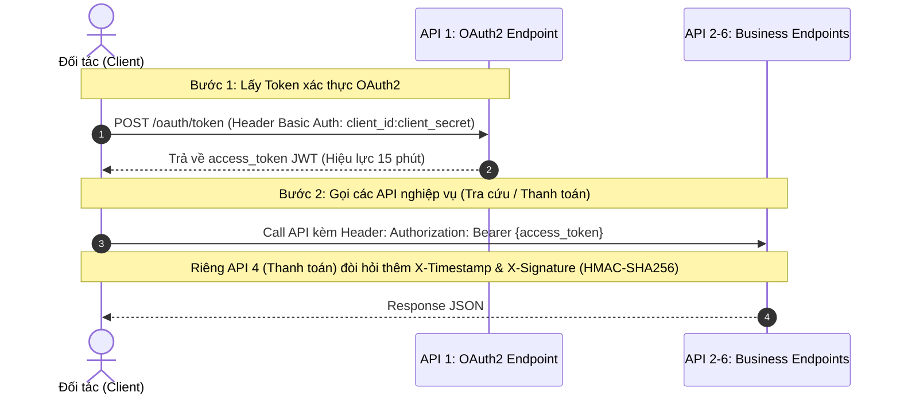

# 📘 DEMOWATER - TÀI LIỆU TÍCH HỢP PAYMENT API (API INTEGRATION GUIDE)

> **Phiên bản:** 1.0.0  
> **Ngày cập nhật:** 29/07/2026  
> **Nhà phát triển:** Công ty Cấp nước Demo (DEMOWATER)  
> **Đối tượng sử dụng:** Đội ngũ Kỹ thuật / Lập trình viên của các Đối tác Thu hộ (Momo, VNPay, ViettelPay, Ngân hàng...)

---

## 📋 MỤC LỤC
1. [Tổng quan & Môi trường Kết nối](#1-tổng-quan--môi-trường-kết-nối)
2. [Cơ chế Bảo mật & Xác thực](#2-cơ-chế-bảo-mật--xác-thực)
3. [Danh mục Mã Lỗi Hệ thống (Global Error Codes)](#3-danh-mục-mã-lỗi-hệ-thống)
4. [Quy tắc Nghiệp vụ Tài chính & Thu tiền nước](#4-quy-tắc-nghiệp-vụ-tài-chính--thu-tiền-nước)
5. [Chi tiết 6 API Endpoints (API Specification)](#5-chi-tiết-6-api-endpoints)
   - [API 1: Cấp Token OAuth2](#api-1-cấp-token-oauth2-post-integrationv1oauthtoken)
   - [API 2: Tra cứu Hóa đơn nợ theo Mã KH](#api-2-tra-cứu-hóa-đơn-nợ-theo-mã-kh-get-integrationv1customerscustomercodeinvoices)
   - [API 3: Kiểm tra Hóa đơn trước khi thanh toán](#api-3-kiểm-tra-hóa-đơn-trước-khi-thanh-toán-post-integrationv1invoicesvalidate)
   - [API 4: Gạch nợ & Ghi nhận Thanh toán](#api-4-gạch-nợ--ghi-nhận-thanh-toán-post-integrationv1payments)
   - [API 5: Tra cứu Trạng thái Giao dịch](#api-5-tra-cứu-trạng-thái-giao-dịch-get-integrationv1paymentspartnertransactionid)
   - [API 6: Tra cứu Hóa đơn bằng SMS Token](#api-6-tra-cứu-hóa-đơn-bằng-sms-token-get-integrationv1payment-linkstokeninvoices)
6. [Tài khoản Thử nghiệm & Kịch bản Test Tích hợp](#6-tài-khoản-thử-nghiệm--kịch-bản-test-tích-hợp)

---

## 1. TỔNG QUAN & MÔI TRƯỜNG KẾT NỐI

Hệ thống **Utility Payment Integration API** cung cấp phương thức kết nối an toàn, tốc độ cao giữa hệ thống quản lý Cấp nước DEMOWATER và các Đối tác Thu hộ trung gian.

### 🌐 Môi trường Kết nối Demo (Endpoint)
- **Môi trường Thử nghiệm (Demo / Sandbox):**  
  `https://api.example.com/integration/v1`

### 📏 Quy chuẩn Dữ liệu
- **Định dạng dữ liệu:** `JSON` (Mã hóa `UTF-8`).
- **Định dạng thời gian:** Chuẩn ISO-8601 UTC (`YYYY-MM-DDTHH:mm:ssZ`).
- **Đơn vị tiền tệ:** Đồng Việt Nam (`VND`), kiểu số nguyên `long`.

---

## 2. CƠ CHẾ BẢO MẬT & XÁC THỰC

Hệ thống áp dụng cơ chế bảo mật đa lớp theo chuẩn ngân hàng (Defense-in-Depth):



### 🔐 2.1. Xác thực JWT (OAuth 2.0 Client Credentials)
- Mỗi đối tác được cấp một cặp **`client_id`** và **`client_secret`**.
- Đối tác gọi **API 1** để lấy `access_token`.
- Mọi API tiếp theo (từ API 2 đến API 6) đều phải đính kèm Header:
  ```http
  Authorization: Bearer {access_token}
  ```

### 🛡️ 2.2. Chữ ký số HMAC-SHA256 & Cửa sổ Timestamp (Áp dụng riêng cho API 4 Gạch nợ)
API Gạch nợ (`POST /payments`) đòi hỏi thêm 2 HTTP Header bắt buộc để chống sửa đổi dữ liệu (Data Tampering) và chống phát lại giao dịch (Replay Attack):

- **Header `X-Timestamp`:** Số giây Unix UTC tại thời điểm gửi (`Unix Epoch Time in Seconds`). Hệ thống từ chối nếu thời gian lệch quá **5 phút** (300 giây) so với Server.
- **Header `X-Signature`:** Mã băm HMAC-SHA256 chuyển sang dạng **chuỗi Hex viết thường (lower-case hex)**.

#### 🧮 Công thức tạo Chữ ký số `X-Signature`:
1. Tạo chuỗi chuẩn hóa (Canonical String):
   ```text
   HTTP_METHOD\nPATH\nTIMESTAMP\nRAW_BODY
   ```
   *Ví dụ thực tế:*
   ```text
   POST
   /integration/v1/payments
   1785230000
   {"partnerTransactionId":"PARTNER-001","customerCode":100001,"totalAmount":214000,"invoices":[{"invoiceCode":900001,"amountApplied":214000}]}
   ```
2. Băm HMAC-SHA256 chuỗi trên với Khóa bí mật **`client_secret`**:
   $$\text{Signature} = \text{HMAC-SHA256}(\text{client\_secret}, \text{CanonicalString}).\text{ToLowerHex}()$$

### ⏱️ 2.3. Chính sách Hạn mức Tần suất (Rate Limiting Policy)
Để đảm bảo ổn định hệ thống, hạn mức gọi API được áp dụng theo từng `clientId` (Reset mỗi 60 giây):

| API Endpoint | Hạn mức mặc định | Hành vi khi vượt hạn mức |
|---|---|---|
| **API 1: OAuth Token** | 5 lần đăng nhập sai / phút per IP | Khóa đăng nhập từ IP đó trong 60s (`429 Too Many Requests`) |
| **API 2: Tra cứu Nợ** | 100 req / phút | `HTTP 429 Too Many Requests` |
| **API 3: Kiểm tra Hóa đơn** | 100 req / phút | `HTTP 429 Too Many Requests` |
| **API 4: Gạch nợ Thanh toán** | 100 req / phút | `HTTP 429 Too Many Requests` |
| **API 5: Tra cứu Trạng thái** | 100 req / phút | `HTTP 429 Too Many Requests` |
| **API 6: SMS Payment Link** | 5,000 req / phút | `HTTP 429 Too Many Requests` |

---

## 3. DANH MỤC MÃ LỖI HỆ THỐNG

### 🚦 3.1. Mã Trạng thái HTTP (HTTP Status Codes)
- **`200 OK`:** Xử lý thành công (Kiểm tra trường `status` trong JSON để biết kết quả nghiệp vụ `SUCCESS` hay `FAILED`).
- **`400 Bad Request`:** Lỗi cú pháp JSON, thiếu trường dữ liệu bắt buộc (`invalid_request`), hoặc Token quá hạn (`token_expired`).
- **`401 Unauthorized`:** Chưa xác thực Bearer Token, sai Chữ ký số (`invalid_signature`), hoặc quá hạn Timestamp (`timestamp_expired`).
- **`403 Forbidden`:** Client chưa được cấp quyền gạch nợ thanh toán (`not_authorized_for_payment`).
- **`404 Not Found`:** Không tìm thấy Khách hàng, Hóa đơn hoặc Mã giao dịch.
- **`409 Conflict`:** Giao dịch trùng lắp đang trong tiến trình xử lý (`processing_in_progress`).
- **`429 Too Many Requests`:** Vượt hạn mức Rate Limit cho phép.
- **`500 Internal Server Error`:** Lỗi hệ thống nội bộ.

### 📚 3.2. Bảng Tra cứu Mã Lỗi Nghiệp vụ (`errorCode`)

| `errorCode` | `errorMessage` (Mẫu tiếng Việt) | Nguyên nhân & Hướng xử lý |
|---|---|---|
| **`invalid_request`** | `"Danh sách hóa đơn thanh toán rỗng."` | Request thiếu thông tin bắt buộc hoặc mảng `invoices` rỗng. |
| **`invalid_signature`** | `"Chữ ký số HMAC không hợp lệ."` | Sai công thức băm HMAC hoặc sai `client_secret`. |
| **`timestamp_expired`** | `"Thời gian request vượt quá ngưỡng cho phép (5 phút)."` | Đồng hồ máy chủ Client bị lệch quá 5 phút so với UTC. |
| **`not_authorized_for_payment`** | `"Client không có quyền thực hiện thanh toán."` | Tài khoản đối tác chưa được DEMOWATER cấp quyền gạch nợ thanh toán. |
| **`processing_in_progress`** | `"Giao dịch đang được xử lý, vui lòng chờ."` | Gửi trùng `partnerTransactionId` khi giao dịch trước đó chưa xong. |
| **`customer_not_eligible`** | `"Khách hàng không tồn tại hoặc không đủ điều kiện thu tiền."` | Khách hàng đang bị tạm ngưng dịch vụ cấp nước hoặc khóa đồng hồ. |
| **`prior_invoices_unpaid`** | `"Khách hàng còn hóa đơn thuộc kỳ cũ hơn chưa được thanh toán."` | Vi phạm quy tắc gạch nợ từ kỳ cũ nhất đến mới nhất (Bỏ nhảy kỳ). |
| **`amount_mismatch`** | `"Số tiền thanh toán không khớp với số tiền của hóa đơn trên hệ thống."` | Tổng tiền `totalAmount` lệch với tổng tiền các hóa đơn hoặc sai tiền nợ thực tế của 1 hóa đơn. |
| **`already_paid`** | `"Hóa đơn đã được ghi nhận thanh toán trước đó."` | Hóa đơn đã được ghi nhận thanh toán hoàn tất trước đó. |
| **`invoice_not_found`** | `"Hóa đơn không tồn tại hoặc không thuộc về khách hàng."` | Mã hóa đơn không đúng hoặc hóa đơn thuộc về khách hàng khác. |
| **`invoice_not_issued`** | `"Hóa đơn chưa được phát hành chính thức."` | Hóa đơn điện tử chưa được phát hành chính thức. |
| **`duplicate_invoice_in_request`**| `"Danh sách hóa đơn chứa mã hóa đơn trùng lặp."` | Truyền trùng `invoiceCode` 2 lần trong cùng 1 request JSON. |
| **`transaction_not_found`** | `"Không tìm thấy thông tin giao dịch."` | Mã giao dịch đối tác không tồn tại hoặc thuộc về đối tác khác. |
| **`pay_user_not_found`** | `"Không tìm thấy cấu hình tài khoản thu tiền online cho đối tác."` | Chưa cấu hình `payID` trong bảng `onlPAYuser` cho tài khoản đối tác này. |
| **`invalid_token`** / **`token_expired`** | `"Token không tồn tại hoặc đã hết hạn."` | SMS Link Token không đúng hoặc đã quá hạn 60 ngày. |

---

## 4. QUY TẮC NGHIỆP VỤ TÀI CHÍNH & THU TIỀN NƯỚC

1. **Quy tắc Gạch Nợ Cũ Trước (`prior_invoices_unpaid`):**
   - Khách hàng nợ nhiều kỳ (ví dụ: Tháng 5/2026, 6/2026, 7/2026) **BẮT BUỘC** phải gạch nợ từ kỳ cũ nhất trở đi.
   - Đối tác có quyền thanh toán Kỳ 5, hoặc (Kỳ 5 + 6), hoặc (Kỳ 5 + 6 + 7). Không được phép thanh toán Kỳ 6 hoặc Kỳ 7 khi Kỳ 5 vẫn còn nợ.
2. **Cơ chế Chống Gạch Nợ 2 Lần (Idempotency Rule):**
   - Mọi giao dịch gạch nợ dựa vào cặp duy nhất `(ClientId, PartnerTransactionId)`.
   - Nếu bị rớt mạng và Client gửi lại request với cùng `PartnerTransactionId`:
     - Giao dịch cũ đã `SUCCESS` ➔ API lập tức trả lại **nguyên văn kết quả cũ** kèm mã biên nhận `PMT-xxxxxxxxx` mà **không gạch nợ lần 2**.
3. **Tính Toàn Vẹn Giao Dịch (Atomic All-or-Nothing Transaction):**
   - Khi gạch nợ mảng $N$ hóa đơn, tất cả $N$ hóa đơn phải cùng hợp lệ và được gạch nợ thành công trọn vẹn. Nếu có bất kỳ lỗi nào xảy ra ở 1 hóa đơn, hệ thống sẽ **hủy toàn bộ giao dịch về trạng thái ban đầu**.
4. **Không Gạch Nợ Từng Phần (Full Invoice Payment Only):**
   - Số tiền gạch nợ `amountApplied` cho từng hóa đơn phải **chính xác bằng 100% số tiền nợ thực tế của hóa đơn**.

---

## 5. CHI TIẾT 6 API ENDPOINTS

### API 1: Cấp Token OAuth2 (`POST /integration/v1/oauth/token`)

- **Phương thức:** `POST`
- **Đường dẫn:** `https://api.example.com/integration/v1/oauth/token`
- **Xác thực:** `Basic Authentication` (`Header Authorization: Basic Base64(client_id:client_secret)`).
- **Content-Type:** `application/x-www-form-urlencoded`

#### Body Tham số Đầu vào:
| Tham số | Kiểu dữ liệu | Bắt buộc? | Giá trị mẫu | Mô tả |
|---|---|---|---|---|
| `grant_type` | `string` | **Có** | `"client_credentials"` | Phải đúng chuỗi `"client_credentials"`. |

#### Response Thành công (`HTTP 200 OK`):
```json
{
  "access_token": "eyJhbGciOiJIUzI1NiIsInR5cCI6IkpXVCJ9...",
  "token_type": "Bearer",
  "expires_in": 900
}
```

#### Tham số Trả về (Response Output):
| Tham số | Kiểu dữ liệu | Có thể Null? | Mô tả |
|---|---|---|---|
| `access_token` | `string` | Không | Chuỗi mã JWT Token xác thực dùng cho các API tiếp theo. |
| `token_type` | `string` | Không | Loại Token xác thực (Luôn là `"Bearer"`). |
| `expires_in` | `integer` | Không | Thời gian hiệu lực của Token tính bằng giây (Mặc định `900` giây = 15 phút). |

#### Response Thất bại (`HTTP 401 Unauthorized`):
```json
{
  "error": "invalid_client",
  "error_description": "Invalid client_id or client_secret."
}
```

---

### API 2: Tra cứu Hóa đơn nợ theo Mã KH (`GET /integration/v1/customers/{customerCode}/invoices`)

- **Phương thức:** `GET`
- **Đường dẫn:** `https://api.example.com/integration/v1/customers/{customerCode}/invoices`
- **Xác thực:** `Bearer Token` (`Header Authorization: Bearer {access_token}`).

#### Tham số Đường dẫn (Path Parameter):
| Tham số | Kiểu dữ liệu | Bắt buộc? | Giá trị mẫu | Mô tả |
|---|---|---|---|---|
| `customerCode` | `integer` | **Có** | `100001` | Mã số khách hàng dùng nước. |

#### Response Thành công (`HTTP 200 OK` - Khách hàng còn nợ):
```json
{
  "customerCode": 100001,
  "customerName": "NGUYỄN VĂN A",
  "address": "123 Đường ABC, Phường X, Quận Y",
  "phoneNumber": "0900000000",
  "eligibleForCollection": true,
  "totalAmountDue": 387311,
  "invoices": [
    {
      "invoiceCode": 900002,
      "period": "05/2026",
      "amountDue": 198621,
      "serialNumber": "00024365",
      "invoiceTemplate": "1/001",
      "invoiceSeries": "AA/26E"
    },
    {
      "invoiceCode": 900003,
      "period": "06/2026",
      "amountDue": 188690,
      "serialNumber": "00024366",
      "invoiceTemplate": "1/001",
      "invoiceSeries": "AA/26E"
    }
  ]
}
```

#### Tham số Trả về (Response Output):
| Tham số | Kiểu dữ liệu | Có thể Null? | Mô tả |
|---|---|---|---|
| `customerCode` | `integer` | Không | Mã số khách hàng dùng nước. |
| `customerName` | `string` | Không | Tên đầy đủ của khách hàng. |
| `address` | `string` | **Có** | Địa chỉ đăng ký sử dụng nước. |
| `phoneNumber` | `string` | **Có** | Số điện thoại liên hệ của khách hàng. |
| `eligibleForCollection` | `boolean` | Không | Trạng thái thu nợ (`true`: Hợp lệ đủ điều kiện thu nợ, `false`: Tạm ngưng/khóa đồng hồ). |
| `totalAmountDue` | `long` | Không | Tổng số tiền nợ đọng của tất cả các hóa đơn (VND). |
| `invoices` | `array` | Không | Mảng danh sách các hóa đơn nợ chưa thanh toán. |
| `invoices[].invoiceCode` | `integer` | Không | Mã hóa đơn điện tử. |
| `invoices[].period` | `string` | Không | Kỳ tiền nước (Định dạng: `MM/YYYY`). |
| `invoices[].amountDue` | `long` | Không | Số tiền nợ thực tế của hóa đơn này (VND). |
| `invoices[].serialNumber` | `string` | **Có** | Số Serial của hóa đơn điện tử. |
| `invoices[].invoiceTemplate` | `string` | **Có** | Mẫu số hóa đơn điện tử (Ví dụ: `1/001`). |
| `invoices[].invoiceSeries` | `string` | **Có** | Ký hiệu hóa đơn điện tử (Ví dụ: `AA/26E`). |

#### Response Trường hợp Khách không tồn tại (`HTTP 404 Not Found`):
```json
{
  "error": "customer_not_found"
}
```

---

### API 3: Kiểm tra Hóa đơn trước khi thanh toán (`POST /integration/v1/invoices/validate`)

- **Phương thức:** `POST`
- **Đường dẫn:** `https://api.example.com/integration/v1/invoices/validate`
- **Xác thực:** `Bearer Token` (`Header Authorization: Bearer {access_token}`).
- **Content-Type:** `application/json`

#### Body JSON Request:
```json
{
  "customerCode": 100001,
  "invoiceCode": 900001
}
```

#### Tham số Đầu vào (JSON Body):
| Tham số | Kiểu dữ liệu | Bắt buộc? | Giá trị mẫu | Mô tả |
|---|---|---|---|---|
| `customerCode` | `integer` | **Có** | `100001` | Mã số khách hàng dùng nước. |
| `invoiceCode` | `integer` | **Có** | `900001` | Mã số hóa đơn điện tử cần kiểm tra. |

#### Response Thành công (`HTTP 200 OK` - Hóa đơn hợp lệ):
```json
{
  "valid": true,
  "reason": null
}
```

#### Tham số Trả về (Response Output):
| Tham số | Kiểu dữ liệu | Có thể Null? | Mô tả |
|---|---|---|---|
| `valid` | `boolean` | Không | Trạng thái hợp lệ (`true`: Hóa đơn đủ điều kiện gạch nợ, `false`: Không hợp lệ). |
| `reason` | `string` | **Có** | Mã nguyên nhân khi `valid = false` (Ví dụ: `already_paid`, `invoice_not_found`...). Trả về `null` nếu hợp lệ. |

#### Response Trường hợp Hóa đơn đã trả rồi (`HTTP 200 OK`):
```json
{
  "valid": false,
  "reason": "already_paid"
}
```

---

### API 4: Gạch nợ & Ghi nhận Thanh toán (`POST /integration/v1/payments`)

- **Phương thức:** `POST`
- **Đường dẫn:** `https://api.example.com/integration/v1/payments`
- **Xác thực:** `Bearer Token` + `X-Timestamp` + `X-Signature` (HMAC-SHA256).
- **Content-Type:** `application/json`

#### Body JSON Request:
```json
{
  "partnerTransactionId": "PARTNER-TXN-20260729-001",
  "gatewayTransactionId": "GW-VNPAY-998877",
  "customerCode": 100001,
  "totalAmount": 214000,
  "paymentTime": "2026-07-29T08:30:00Z",
  "paymentProvider": "VNPay",
  "paymentChannel": "QR_CODE",
  "payerAccountHolder": "NGUYEN VAN A",
  "payerAccountNumber": "9704198888888888",
  "invoices": [
    {
      "invoiceCode": 900001,
      "amountApplied": 214000
    }
  ]
}
```

#### Tham số Đầu vào (JSON Body):
| Tham số | Kiểu dữ liệu | Bắt buộc? | Giá trị mẫu | Mô tả |
|---|---|---|---|---|
| `partnerTransactionId` | `string` | **Có** | `"PARTNER-TXN-20260729-001"` | Mã giao dịch duy nhất do Đối tác tự sinh (Max 100 ký tự). Dùng để kiểm tra chống gạch nợ trùng (Idempotency). |
| `gatewayTransactionId` | `string` | Không | `"GW-VNPAY-998877"` | Mã giao dịch tham chiếu từ Cổng thanh toán (VNPay, Momo...) nếu có. |
| `customerCode` | `integer` | **Có** | `100001` | Mã số khách hàng dùng nước cần gạch nợ. |
| `totalAmount` | `long` | **Có** | `214000` | Tổng số tiền thanh toán thực tế (VND). Phải bằng đúng tổng `amountApplied` của các hóa đơn. |
| `paymentTime` | `string` | **Có** | `"2026-07-29T08:30:00Z"` | Thời điểm thanh toán thực tế theo chuẩn ISO-8601 UTC (`YYYY-MM-DDTHH:mm:ssZ`). |
| `paymentProvider` | `string` | Không | `"VNPay"` | Tên đơn vị / Ngân hàng cung cấp kênh thanh toán (Ví dụ: `VNPay`, `Momo`, `VietinBank`...). |
| `paymentChannel` | `string` | Không | `"QR_CODE"` | Kênh thanh toán (Ví dụ: `QR_CODE`, `APP`, `COUNTER`, `AUTO_DEBIT`). |
| `payerAccountHolder` | `string` | Không | `"NGUYEN VAN A"` | Tên chủ tài khoản / Người thực hiện chuyển tiền thanh toán. |
| `payerAccountNumber` | `string` | Không | `"9704198888888888"` | Số tài khoản / Số thẻ của người thanh toán. |
| `invoices` | `array` | **Có** | `[...]` | Danh sách mảng các hóa đơn cần gạch nợ (Tuân thủ quy tắc từ kỳ cũ đến kỳ mới). |
| `invoices[].invoiceCode` | `integer` | **Có** | `900001` | Mã hóa đơn điện tử cần gạch nợ. |
| `invoices[].amountApplied` | `long` | **Có** | `214000` | Số tiền gạch nợ cho hóa đơn này (Phải đúng 100% số tiền nợ của hóa đơn). |

#### Response Gạch nợ Thành công (`HTTP 200 OK`):
```json
{
  "status": "SUCCESS",
  "receiptCode": "PMT-000000138",
  "processedAt": "2026-07-29T08:30:01.1234567Z",
  "errorCode": null,
  "errorMessage": null
}
```

#### Tham số Trả về (Response Output):
| Tham số | Kiểu dữ liệu | Có thể Null? | Mô tả |
|---|---|---|---|
| `status` | `string` | Không | Trạng thái kết quả gạch nợ (`"SUCCESS"`: Thành công, `"FAILED"`: Thất bại). |
| `receiptCode` | `string` | **Có** | Mã số biên nhận gạch nợ chính thức do DEMOWATER phát hành (Dạng `PMT-xxxxxxxxx`). Trả về `null` nếu thất bại. |
| `processedAt` | `string` | Không | Thời điểm hệ thống hoàn tất xử lý giao dịch (Chuẩn ISO-8601 UTC). |
| `errorCode` | `string` | **Có** | Mã lỗi nghiệp vụ nếu `status = "FAILED"` (Ví dụ: `prior_invoices_unpaid`, `amount_mismatch`...). Trả về `null` nếu thành công. |
| `errorMessage` | `string` | **Có** | Thông điệp giải thích lỗi tiếng Việt chi tiết nếu thất bại. Trả về `null` nếu thành công. |

#### Response Gạch nợ Thất bại do Nhảy kỳ nợ (`HTTP 200 OK`):
```json
{
  "status": "FAILED",
  "receiptCode": null,
  "processedAt": "2026-07-29T08:30:01.1234567Z",
  "errorCode": "prior_invoices_unpaid",
  "errorMessage": "Khách hàng còn hóa đơn thuộc kỳ cũ hơn chưa được thanh toán."
}
```

---

### API 5: Tra cứu Trạng thái Giao dịch (`GET /integration/v1/payments/{partnerTransactionId}`)

- **Phương thức:** `GET`
- **Đường dẫn:** `https://api.example.com/integration/v1/payments/{partnerTransactionId}`
- **Xác thực:** `Bearer Token` (`Header Authorization: Bearer {access_token}`).

#### Tham số Đường dẫn (Path Parameter):
| Tham số | Kiểu dữ liệu | Bắt buộc? | Giá trị mẫu | Mô tả |
|---|---|---|---|---|
| `partnerTransactionId` | `string` | **Có** | `"PARTNER-TXN-20260729-001"` | Mã giao dịch đối tác đã truyền lúc gọi API 4 Gạch nợ. |

#### Response Thành công (`HTTP 200 OK`):
```json
{
  "partnerTransactionId": "PARTNER-TXN-20260729-001",
  "status": "SUCCESS",
  "receiptCode": "PMT-000000138",
  "processedAt": "2026-07-29T08:30:01Z",
  "errorCode": null,
  "errorMessage": null
}
```

#### Tham số Trả về (Response Output):
| Tham số | Kiểu dữ liệu | Có thể Null? | Mô tả |
|---|---|---|---|
| `partnerTransactionId` | `string` | Không | Mã giao dịch đối tác cần tra cứu. |
| `status` | `string` | Không | Trạng thái kết quả gạch nợ (`"SUCCESS"`: Thành công, `"FAILED"`: Thất bại). |
| `receiptCode` | `string` | **Có** | Mã số biên nhận gạch nợ của DEMOWATER (`PMT-xxxxxxxxx`). Trả về `null` nếu thất bại. |
| `processedAt` | `string` | Không | Thời điểm xử lý giao dịch (Chuẩn ISO-8601 UTC). |
| `errorCode` | `string` | **Có** | Mã lỗi nghiệp vụ nếu thất bại. Trả về `null` nếu thành công. |
| `errorMessage` | `string` | **Có** | Thông điệp giải thích lỗi tiếng Việt nếu thất bại. Trả về `null` nếu thành công. |

---

### API 6: Tra cứu Hóa đơn bằng SMS Token (`GET /integration/v1/payment-links/{token}/invoices`)

- **Phương thức:** `GET`
- **Đường dẫn:** `https://api.example.com/integration/v1/payment-links/{token}/invoices`
- **Xác thực:** `Bearer Token` (`Header Authorization: Bearer {access_token}`).
- **Rate Limit:** 5,000 req / phút per ClientId.

#### Tham số Đường dẫn (Path Parameter):
| Tham số | Kiểu dữ liệu | Bắt buộc? | Giá trị mẫu | Mô tả |
|---|---|---|---|---|
| `token` | `string` | **Có** | `"aB9kL2xP8z"` | Mã Token SMS rút gọn 10 ký tự nằm trong Link tra cứu gửi qua tin nhắn. |

#### Response Thành công (`HTTP 200 OK`):
```json
{
  "customerCode": 100001,
  "customerName": "NGUYỄN VĂN A",
  "eligibleForCollection": true,
  "totalAmountDue": 214000,
  "invoices": [
    {
      "invoiceCode": 900001,
      "period": "05/2026",
      "amountDue": 214000
    }
  ]
}
```

#### Tham số Trả về (Response Output):
| Tham số | Kiểu dữ liệu | Có thể Null? | Mô tả |
|---|---|---|---|
| `customerCode` | `integer` | Không | Mã số khách hàng dùng nước. |
| `customerName` | `string` | Không | Tên đầy đủ của khách hàng. |
| `eligibleForCollection` | `boolean` | Không | Trạng thái thu nợ (`true`: Hợp lệ đủ điều kiện thu nợ, `false`: Tạm ngưng/khóa đồng hồ). |
| `totalAmountDue` | `long` | Không | Tổng số tiền nợ đọng của các hóa đơn (VND). |
| `invoices` | `array` | Không | Mảng danh sách các hóa đơn nợ chưa thanh toán. |
| `invoices[].invoiceCode` | `integer` | Không | Mã hóa đơn điện tử. |
| `invoices[].period` | `string` | Không | Kỳ tiền nước (Định dạng: `MM/YYYY`). |
| `invoices[].amountDue` | `long` | Không | Số tiền nợ thực tế của hóa đơn này (VND). |

---

## 6. TÀI KHOẢN THỬ NGHIỆM & KỊCH BẢN TEST TÍCH HỢP

### 🔑 6.1. Tài khoản Demo Sandbox
Để thực hiện test trên môi trường Demo, đối tác sử dụng thông tin sau:
- **Client ID:** `demo_partner`
- **Client Secret:** `<được cấp riêng cho từng đối tác qua kênh bảo mật>`

### 🧪 6.2. 7 Kịch bản Kiểm thử Bắt buộc trước khi Go-Live

1. **Test-case 1 (OAuth2 Token):** Gửi lấy Token thành công và sử dụng Token gọi API 2.
2. **Test-case 2 (Gạch nợ 1 Hóa đơn):** Gạch nợ thành công 1 hóa đơn ➔ Kiểm tra nhận về `status: "SUCCESS"` và `receiptCode`.
3. **Test-case 3 (Gạch nợ Gộp Nhiều Hóa đơn):** Gạch nợ thành công đồng thời mảng 2-3 hóa đơn liên tiếp (từ Kỳ cũ đến Kỳ mới) ➔ Kiểm tra nhận về `status: "SUCCESS"` và `receiptCode`.
4. **Test-case 4 (Chống trùng Idempotency):** Gửi lại chính xác 1 `partnerTransactionId` đã `SUCCESS` ➔ Kiểm tra nhận lại đúng kết quả cũ.
5. **Test-case 5 (Kiểm tra Chữ ký HMAC):** Cố tình sửa 1 chữ số trong JSON body nhưng giữ nguyên `X-Signature` ➔ API phải trả về `401 invalid_signature`.
6. **Test-case 6 (Quy tắc Kỳ cũ `prior_invoices_unpaid`):** Thử gạch nợ kỳ mới khi kỳ cũ chưa trả (bỏ nhảy kỳ) ➔ API phải từ chối với lỗi `prior_invoices_unpaid`.
7. **Test-case 7 (Sai số tiền `amount_mismatch`):** Truyền sai số tiền `amountApplied` cho 1 hóa đơn ➔ API phải từ chối với lỗi `amount_mismatch`.
